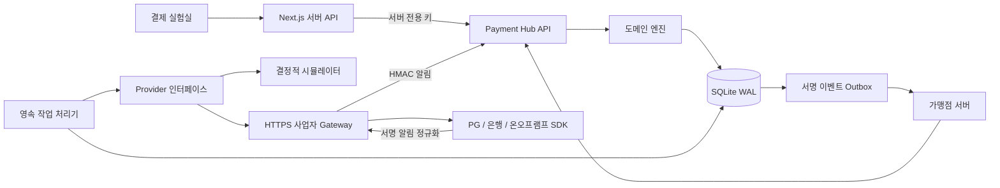

# 결제 서비스 구조

`domain.ts`는 금액과 데이터 계약, `engine.ts`는 상태 전이 및 보상, `store.ts`는 트랜잭션과 영속 작업, `providers.ts`는 시뮬레이터/사업자 경계, `outbox.ts`는 가맹점 이벤트 전달을 담당한다.

| 흐름 | 성공 경로 | 실패·복구 |
|---|---|---|
| 가맹점 결제 | created → authorized → captured → settled | requires_action 후 authenticate; 승인 취소; 부분/전액 환불; 정산 후 환불 |
| 온램프 | created → payment_pending → processing → completed | 송금 거절 → refund_pending → refunded |
| 오프램프 | created → deposit_pending → processing → completed | 지급 거절 → refund_pending → refunded(코인 반환) |

사업자 통신 오류는 주문 실패를 뜻하지 않는다. 작업은 같은 operation ID로 재시도하고, 재시도 소진 시 dead로 보존한다. 상태 조회나 늦게 도착한 서명 알림으로 성공 여부를 확인한다. 성공 여부를 모르는 상태에서 반대 방향의 환불을 자동 실행하지 않는다. 확정된 송금/지급 거절만 보상 작업을 생성한다. 보상 거절은 review_required로 남기며 operator가 재시도할 수 있다.

## 일관성

- 주문 생성 + 견적 사용 + 명령 + 이벤트 + API 멱등 응답을 하나의 DB 트랜잭션으로 저장한다.
- 네트워크 호출 동안 DB 잠금을 유지하지 않는다. 명령 결과, 주문 상태, 원장 및 Outbox 기록은 함께 커밋된다.
- 명령은 30초 lease를 사용한다. 프로세스가 중단되면 lease가 지난 명령을 동일 ID로 재실행한다. 외부 효과의 중복 방지는 사업자가 동일 멱등 키를 준수하는 것에 의존한다.
- webhook event ID와 내용 해시를 영속 저장한다. 같은 ID의 다른 내용, 다른 주문/사업자 참조, 확정된 작업과 상충하는 결과는 거절한다.
- KYC는 고객별 단조 증가 version을 요구하여 이전 승인 알림이 최신 거절을 덮어쓰지 못하게 한다.
- 거래 금액은 정수 문자열이다. KRW=1원, USD=1센트, USDC=10^-6 토큰. 부동소수점으로 잔액을 계산하지 않는다.
- 원장은 자산별 차변·대변 합이 0인지 검사한다. 이는 외부 사업자의 잔고가 일치한다는 증명이 아니다. 개별 operation 대사는 provider lookup으로 수행한다.
- 환불 누계는 원금 이하로 제한한다. 이미 정산된 주문의 재정산을 차단하고 정산 후 환불은 paid_out 계정에 기록한다.

## 시뮬레이션

고정 환율은 1 USDC = 1 USD = 1,350 KRW이며 램프 수수료는 입력 금액의 1%를 올림한다. 가맹점 결제 수수료는 0이다. 실제 시장 견적이 아니다. 실제 provider 모드는 gateway 견적을 사용한다.

`success`, `declined`, `requires_action`, `delayed`, `timeout`, `transfer_failed`, `payout_failed`를 선택한다. 체인 TxHash를 임의로 생성하지 않고 `simulation:<operationId>` 증빙을 사용한다. 램프는 가상 KYC 승인 후 입금 확인을 명시적으로 실행한다.

## 웹 및 배포 경계

브라우저는 서비스 키를 받지 않는다. 서버 프록시가 고정된 경로만 전달하고 POST origin을 확인한다. Payment Lab은 simulator capability가 확인되는 백엔드에만 연결한다. 실사업자 환경은 가맹점 서버가 인증된 API를 사용하고, 본인확인/카드 토큰화/추가 인증 UI는 해당 사업자의 hosted flow에서 처리한다.

SQLite 및 현재 처리기는 단일 노드 배포를 대상으로 한다. 다중 노드·리전 배포에는 서버형 DB, 잠금/lease와 Outbox 수신 중복 처리의 적합성 검증이 필요하다. API 키는 특정 merchant/role에 연결한다. 로컬 실험실은 demo merchant의 operator 권한이므로 공개 인터넷에 그대로 노출하는 배포 형태를 제공하지 않는다.
